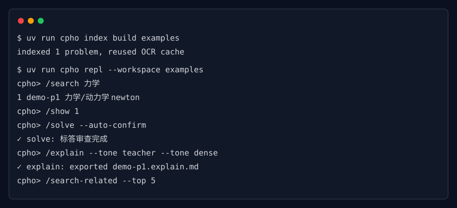

# CPHO CLI

[](LICENSE)
[](pyproject.toml)
[](https://github.com/astral-sh/uv)

物理竞赛题库的本地命令行工作台：索引 PDF/图片题库，审查标答，生成板块化讲解，主动追问关键步骤，查找同类题，管理私有/社区知识库，并按编排文件拼装 PDF 试卷。



## Quick Start

直接安装请先看：[docs/user/install.md](docs/user/install.md)。Windows 用户下载 GitHub Releases 里的安装器；Mac 用户按 Homebrew + uv 路径安装。

开发者本地运行：

```bash
git clone https://github.com/zyzericzhang/cpho-cli.git
cd cpho-cli
uv sync
```

创建本地配置。不要提交真实 key。

```yaml
# config.local.yml
active_provider: openrouter
providers:
  openrouter:
    kind: openrouter
    api_key_env: OPENROUTER_API_KEY
    base_url: https://openrouter.ai/api/v1
    default_model: openai/gpt-4o-mini
model:
  name: openai/gpt-4o-mini
  temperature: 0.2
```

索引题库并进入 REPL：

```bash
uv run cpho index /path/to/workspace --config config.local.yml
uv run cpho repl --workspace /path/to/workspace --config config.local.yml
```

常用 REPL 流程：

```text
/search 力学
/show 1
/solve --auto-confirm --persist-tags
/explain --panel approach --panel answer_replacement
/probe
```

退出 REPL：按 Ctrl-D。Probe 内连续两次空回答会结束当前追问。

## 功能矩阵

| 功能 | CLI | REPL | 主要输出 |
|---|---|---|---|
| 建索引 | `cpho index <workspace>` | `/index` | `.cpho/index.jsonl` |
| 浏览主题 | `cpho topic browse <path> <workspace>` | `/search`, `/show` | 表格 |
| 标答审查 | `cpho solve` | `/solve` | JSON + Markdown |
| 板块讲解 | - | `/explain --panel ...` | `.explain.md` |
| 主动追问 | - | `/probe` | `.probe.md` |
| 找同类题 | - | `/search-related` | 表格 + Markdown |
| 组卷 | `cpho compose new/build/auto` | `/compose` | 题目 PDF + 答案 PDF |
| 私有知识 | `cpho knowledge normalize/publish/find` | 可在 REPL shell 中调用 | knowledge draft/published md |
| 社区知识 | `cpho knowledge sync` | - | 只读 community KB cache |
| 模型面板 | - | `/skill`, `/model` | `.cpho/skills/*.yml`, model cache |

## Explain v2

`/explain` 不再使用 v1.0 的 tone。现在按板块选择：

| Panel | 用途 |
|---|---|
| `approach` | 思路描述，只讲底层逻辑，不展开完整推导 |
| `answer_replacement` | 补全标答跳步，可直接替代标准答案 |
| `alternative_methods` | 比较其他处理方法 |

Explain 会先查询 `KnowledgeResolver`，按 private > community 优先级引用知识文件，并在输出中写明来源和 `input_modality_used`。

## 知识库

私有知识：

```bash
uv run cpho knowledge normalize note.md --workspace /path/to/workspace --canonical-tag-id free_body_diagram
uv run cpho knowledge publish .cpho/knowledge/drafts/<draft>.md --workspace /path/to/workspace
uv run cpho knowledge find <problem_id> --workspace /path/to/workspace
```

社区知识：

```bash
uv run cpho knowledge sync --workspace /path/to/workspace
```

社区配置默认在 `<workspace>/.cpho/community-kb.yml`，同步到 `~/.cache/cpho/community-kb/<repo>/`，并保持只读。

## 组卷与输出

```bash
uv run cpho compose new weekly --count 5 --workspace /path/to/workspace
uv run cpho compose build /path/to/workspace/.cpho/compositions/weekly.yml --workspace /path/to/workspace
uv run cpho compose auto --count 5 --topic 力学 --tags free_body_diagram --workspace /path/to/workspace
```

默认组卷输出在 `<workspace>/.cpho/exports/compose/`。`--output` 必须在 workspace 内；`index` 会忽略 `.cpho/`、`artifacts/`、`exports/`、`output/`、`outputs/` 这些生成目录。

## 文档

- 安装说明：[docs/user/install.md](docs/user/install.md)
- 用户文档索引：[docs/user/README.md](docs/user/README.md)
- 错误排查索引：[docs/user/errors/README.md](docs/user/errors/README.md)
- 扩展指南：[docs/user/extensions.md](docs/user/extensions.md)
- 真实 API 验证记录：[docs/test-001-real-api-verification.md](docs/test-001-real-api-verification.md), [docs/test-002-real-api-verification.md](docs/test-002-real-api-verification.md)

## 配置

推荐使用环境变量保存密钥：

```bash
export OPENROUTER_API_KEY=...
```

`config.local.yml`、真实测试 workspace 和 API key 不应提交。

## 依赖

| 依赖 | 用途 |
|---|---|
| `uv` | Python 项目管理 |
| `typer` | CLI |
| `prompt_toolkit` | REPL |
| `rapidocr` | OCR |
| `pymupdf` | PDF 读取与组卷 |
| `pydantic` | 严格数据模型 |
| `httpx` | OpenAI-compatible/GitHub API 调用 |
| `jinja2` | Prompt 模板 |

## Out of Scope

当前不提供：自然语言生成新 skill、第三方 skill 包安装、托管文档站、Mac `.dmg` 安装包。

## License

MIT. See [LICENSE](LICENSE).
